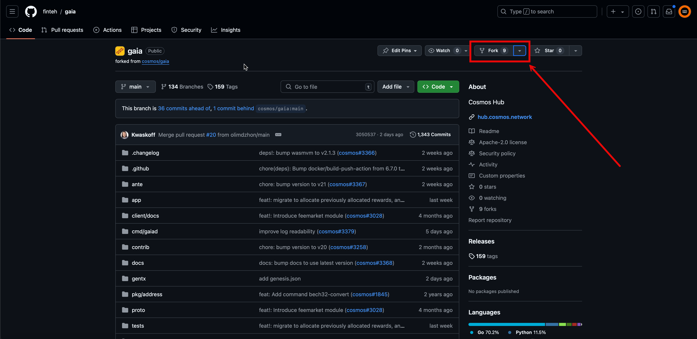
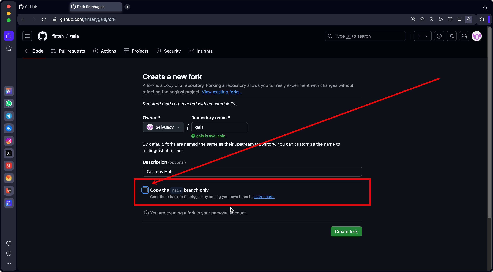
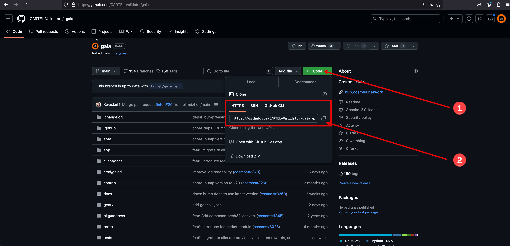
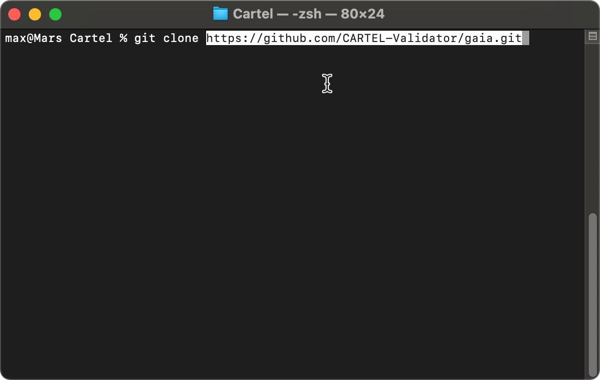
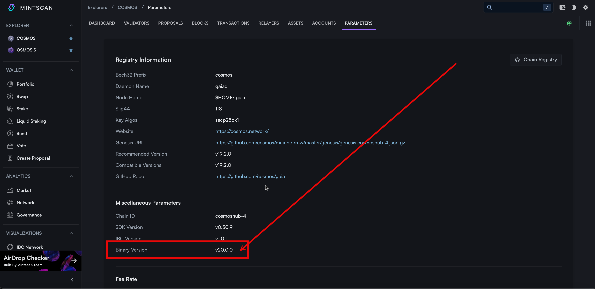
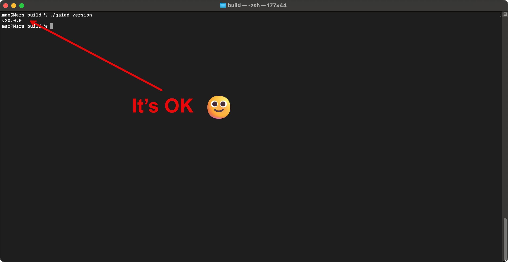

# Установка и настройка GAIA

Gaia — это основная реализация протокола Cosmos SDK, который позволяет создавать блокчейны. Она служит демонстрационным примером для разработчиков, показывая, как использовать возможности Cosmos SDK для создания собственных децентрализованных приложений и систем.

Gaia включает в себя функциональность, необходимую для управления цифровыми активами, обработки транзакций и взаимодействия между различными блокчейнами через протокол IBC (Inter-Blockchain Communication). Это делает его важной частью экосистемы Cosmos, которая стремится к созданию сети взаимосвязанных блокчейнов.

С помощью Gaia разработчики могут легко разрабатывать и развертывать свои собственные блокчейны с минимальными усилиями.

## Основной сайт
[hub.cosmos.network](https://hub.cosmos.network/main)

## Тестовая установка
1. Заходим на сайт [https://github.com/finteh/gaia](https://github.com/finteh/gaia) и делаем форк репозитария к себе.



> Обязательно снимите флажок _Copy the main branch only_


2. Копируем адрес репозитория и клонируем его командой 



и клонируем его командой
``` Shell
git clone <repo-path>
```


3. Узнаём нужную Binary Version (ветку) по адресу  [https://www.mintscan.io/cosmos/parameters/](https://www.mintscan.io/cosmos/parameters/)


 
4. Переключаемся на нужную версию командой _git checkout <branch>_

``` Shell
git checkout v20.0.0
```

>Список версий можно посмотреть командой: `git branch`

>Загрузить последние обновление с удалённого репозитория можно командой: `git pull `


5. Проверяем версию GO
``` Shell
go version
```
Если GO не установлена или версия не актуальная, устанавливаем по ссылке [https://go.dev/doc/install](https://go.dev/doc/install)
(проверяем номер версии на актуальность)

Команды:
``` Shell
 wget https://go.dev/dl/go1.23.2.linux-amd64.tar.gz
 rm -rf /usr/local/go && tar -C /usr/local -xzf go1.23.2.linux-amd64.tar.gz
 export PATH=$PATH:/usr/local/go/bin
```
> Если GO установлен, но не находится - проверьте (и обновите пути)
``` Shell
export PATH=$PATH:/usr/local/go/bin
```
6. Заходим в репозиторий gaia через консоль
``` Shell
cd  <path>/gaia/
```
и запускаем сборку  
``` Shell
make build
```
В папке __build__ должен появиться бинарный файл _gaiad_

7. Проверяем версию командой 
``` Shell
./gaiad version
```
Если указана нужная версия, то бинарный файл собран успешно



